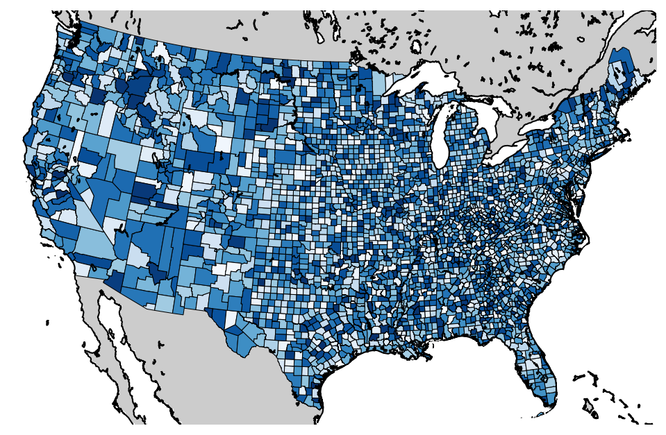

# simple-maps
Python library for easily and quickly creating maps from a shapefile and external data.

One common GIS use case is joining tabular data to a shapefile through a spatial key, then visualizing it on a map.
Libraries such as [Geopandas](geopandas.org) make this task relatively simple to do, however they do not offer much styling flexibility and can take a long time (several minutes) to plot larger shapefiles.
When you are programmatically creating many maps, this latency can add up quickly, and slow down the entire research process.
Additionally, when you are creating maps for use in research papers, having finer control over the map's styling is important.

This library aims to fix these problem by 1.) providing methods that transparently cache the results of intermediate mapping steps to dramatically speed up mapping time, and 2.) providing high level methods that make it easy to quickly perform common mapping tasks.

# Examples/Usage

All of the following examples use the US counties shapefile in `examples/cb_2015_us_county_500k_clipped/`. This file has been clipped to only include shapes from the continental US. The original data is in `examples/cb_2015_us_county_500k` and is from the US Census Bureau's "Cartographic Boundary Shapefiles" and can be downloaded here: [http://www2.census.gov/geo/tiger/GENZ2015/shp/cb_2015_us_county_500k.zip](http://www2.census.gov/geo/tiger/GENZ2015/shp/cb_2015_us_county_500k.zip)

Higher resolution US county shapefiles can be found here: [https://www.census.gov/geo/maps-data/data/cbf/cbf_counties.html](https://www.census.gov/geo/maps-data/data/cbf/cbf_counties.html)

## BasemapUtils

The `BasemapUtils.py` file includes `BasemapWrapper()` which serves as a drop-in replacement for the `Basemap` object constructor (from the [Basemap library](http://matplotlib.org/basemap/)).
`BasemapWrapper` caches instantiated `Basemap` objects to file based on the parameters passed to the constructor.
If a previously created `Basemap` object exists in the cache, then it is loaded from file using `cPickle`, instead of re-instantiated, which results in a dramatic speed up in the `resolution='f'` case.

This file also includes `PolygonPatchesWrapper()` which performs a similar function to `BasemapWrapper` for lists of `matplotlib.shape.Polygon` objects loaded from a shapefile. The process of loading all the shapes from a large shapefile and converting all of their coordinates to Basemap figure coordinates (i.e. transformed with the `Basemap` object) is time consuming. Given a `Basemap` object, its parameters, and a shapefile, the `PolygonPatchesWrapper` object will transparently cache exactly this result. This method can be used as a second step in generating custom maps.

Finally, `BasemapUtils.py` includes serveral accessory functions that make working with spatial libraries easier:
- `getBounds` - Returns the lat/lon bounding box from a shapefile filename.
- `getShapefileColumnHeaders` - Returns a list of headers from a shapefile filename.
- `getShapefileColumn` - Extracts a column from a shapefile by name. This makes it visualize data in a shapefile.

### BasemapWrapper example

See `demoBasemapWrapper.py`. This file will take awhile to run the first time, as the full resolution `Basemap` object is cached to disk, however will run quickly every subsequent execution.
(example benchmark times on my machine show an intial runtime of 203 seconds, with subsequent runs taking 8 seconds)

### PolygonPatchesWrapper example

See `demoPolygonPatchesWrapper.py`. Demonstrates how the `PolygonPatchesWrapper` method can be used to map data (random numbers). 

### Extracting and mapping data from a shapefile example

See `demoExtractingData.py`. Demonstrates how the `PolygonPatchesWrapper` and `getShapefileColumn` methods can be used to create an actual map.

## SimpleFigures.py

To simplify the above steps, we wrap the BasemapWrapper and PolygonPatchesWrapper functionality, along with custom colobar routines into the `SimpleFigures.simpleMap()` method to make it easy to generate maps from spatial data.

### Basic examples

See `demoBasemapWrapper.py`. The following maps demonstrate different arguments to `simpleMap()`.

#### Normal plot

#### Different colormap

#### Custom colorbar range

#### Log colorbar with custom range
