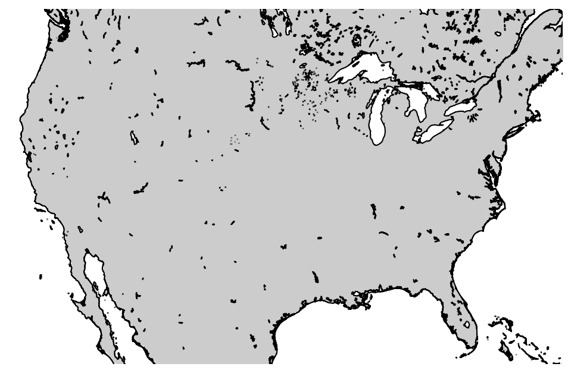
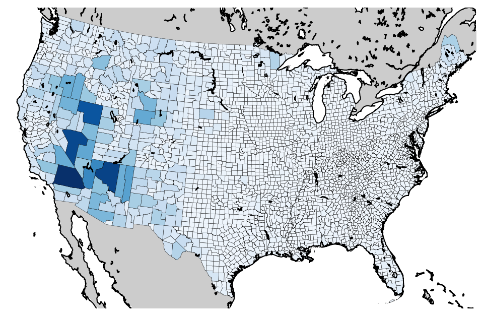

# simple-maps
Python library for easily creating maps from a shapefile and external data.

# Examples

All of the following examples use the US counties shapefile in `examples/cb_2015_us_county_500k_clipped/`. This file has been clipped to only include shapes from the continental US. The original data is in `examples/cb_2015_us_county_500k` and is from the US Census Bureau's "Cartographic Boundary Shapefiles" and can be downloaded here: [http://www2.census.gov/geo/tiger/GENZ2015/shp/cb_2015_us_county_500k.zip](http://www2.census.gov/geo/tiger/GENZ2015/shp/cb_2015_us_county_500k.zip)

Higher resolution US county shapefiles can be found here: [https://www.census.gov/geo/maps-data/data/cbf/cbf_counties.html](https://www.census.gov/geo/maps-data/data/cbf/cbf_counties.html)

## BasemapUtils

### BasemapWrapper

### PolygonPatchesWrapper

### Extracting data from a shapefile

## SimpleFigures.py